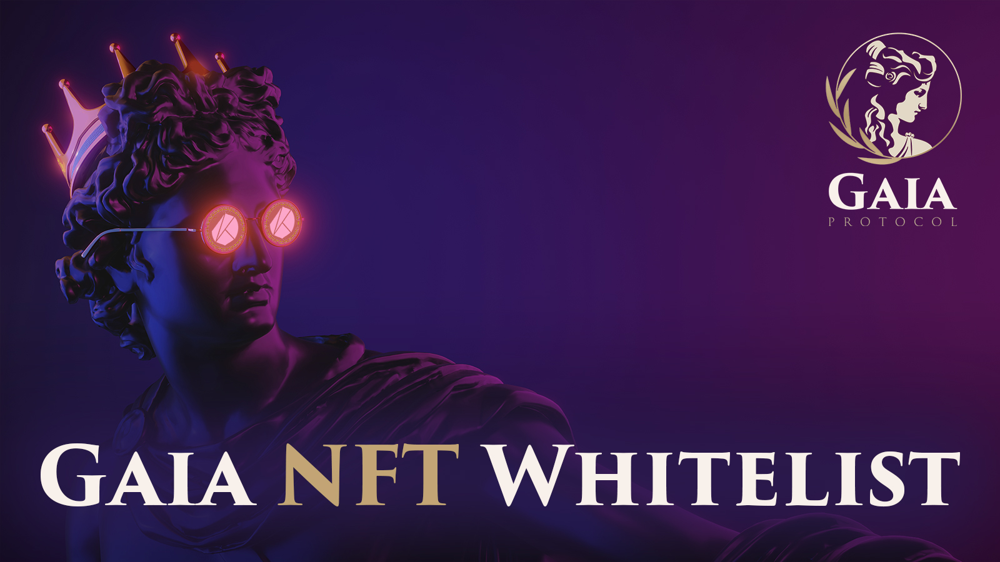

# Whitelist Information

### 화이트리스트 신청: 1/24 (월) - 2/8 (화) 23:00

* 설문링크 배포:   [_**https://wyoz4cv843u.typeform.com/to/pGgR9iHv**_](https://wyoz4cv843u.typeform.com/to/pGgR9iHv)
* 각 토큰들을 보유한 지갑 주소를 기입합니다.
* 보유하지 않은 토큰에 대한 지갑주소 입력란은 비워두셔도 됩니다.
* 최종 단계에서 민팅할 지갑주소란에는 **필히 민팅시 사용할 카이카스 or 클립 지갑 주소**를 기입해주세요.
* 기입된 지갑의 화이트 리스트 대상 NFT 및 코인의 가치 합산하여 확인
  * **1,000 Klay** 가치 당 화이트 리스트 **티켓 1장** 지급됩니다.
  * 1 장의 티켓 당 1개의 NFT 민팅이가능합니다. 1장의 티켓 당 1개의 NFT 민팅이 가능합니다.
  * **1개의 지갑**당 총 **5장**까지(Max Cap) 티켓이 발행됩니다.

### \*\* 민팅은 카이카스와 클립 지갑을 지원합니다 \*\*

### **Token List**

* DSC Mates (Klaytn Chain)
* DSC eMates (Ethereum Chain)
* 떡방앗간 NFT (Klaytn Chain)
* IJM (Klaytn Chain)
* Mix (Klaytn Chain)
* sKRNO/wsKRNO - 담보중인 wsKRNO 포함 (Klaytn Chain)

### 스냅샷: 2/9 (수) \[시간은 미공개]

* 팀에서 스냅샷을 통한 자산확인을 진행하여 티켓을 지갑 별로 배분합니다.
* 코드로 스냅샷을 찍기에 신청자 분들께서 신청할 때 기입한 지갑에 자산을 옮기지 말고 넣어두시기만하면 됩니다.
* 민팅 당시 자산 재확인을 통해 자산 처분 여부 확인 (스냅샷 이후 판매 시 민팅 할 수 없습니다.)
* NFT 가치는 스냅샷 당시 자산들의 Floor Price로 측정하며, 토큰의 가치는 스냅샷 당시의 가격으로 측정합니다.
* Pre-Sale(2/10 22시) 물량은 4,000개이나, 티켓은 4,000장을 초과하여 배부될 수 있습니다.
  * 즉, **선착순으로 민팅**이 진행되므로 티켓 1장이 1개의 민팅을 100% 보장되지 않을 수 있다는 뜻입니다.
* 민팅에 사용하실 1,000 Klay 의 소유 여부는 화이트리스트 티켓 배부에 영향을 주지 않습니다.
* 민팅이 시작 되기 전, 각각의 지갑주소 연결을 통해 **해당 토큰 존재 여부를 재확인**하는 과정이 진행됩니다.
* **최종 화이트리스트 티켓 발행 수량**은 커뮤니티를 통해 공지 예정이며, **스냅샷 이후 민팅 페이지**에서 지갑 연결 후 자신의 **티켓 수량**을 확인하실 수 있습니다.

### Pre-Sale: 2/10 (목) 22:00

* 4,000개 소진시 Pre-Sale은 종료됩니다.
* Price: **1,000 Klay**
* 미판매 물량은 Public Sale 에 포함됩니다. ****&#x20;

### Public-Sale: 2/10 (목) 23:00

* 6,000개 소진시 Public-Sale은 종료됩니다.
* Price: **1,000 Klay**
* 민팅 되지 않은 NFT는 **전량 소각**합니다.

## 관련 프로젝트 링크

* [**Kronos DAO**](https://kronosdao.finance)
* [**DogeSoundClub Mates**](https://opensea.io/collection/dogesoundclub-mates)
* [**DogeSoundClub eMATES**](https://opensea.io/collection/dogesoundclub-emates)
* [**MIX Token**](https://mix.info)
* [**떡방앗간 참새 NFT**](https://klu.bs/pfp/0x29d05593116C443da54DaBFB4e5322DEA2fff8Cd)
* [**IJM Token**](https://tteok.org)

## 관련 프로젝트 Contract

* **KRNO: 0xD676e57Ca65b827fEb112AD81Ff738E7B6c1048d**
* **sKRNO: 0x6555F93f608980526B5cA79b3bE2d4EdadB5C562**
* **wsKRNO:**\
  **0xE944134903694EBdbB56aaDcfBdF400fB52ea487**
* **DSC Mates: 0xe47e90c58f8336a2f24bcd9bcb530e2e02e1e8ae**
* **DSC e-Mates:**\
  **0xD0242443f18586C389a1013539e93f3a7b27018C**
* **MIX: 0xdd483a970a7a7fef2b223c3510fac852799a88bf**
* **IJM: 0x0268dbed3832b87582b1fa508acf5958cbb1cd74**
* **sIJM: 0x485ec445ad112acc33909bc7918f9fe282a1c330**
